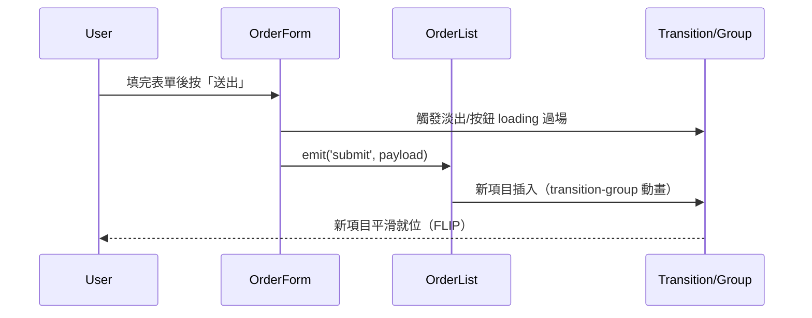
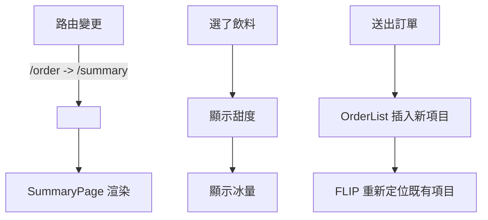

# Day 18｜過場魔法：用 Vue Transition 讓點單更順眼、更懂你

## 你會做到什麼

* 頁面切換有**柔順轉場**（Order ↔ Summary ↔ Detail）。
* 表單的「步驟 1/2/3」用**滑入/淡入**出現，協助視線流動。
* 送單 / 刪除時，列表項目**平滑插入/移除**（避免「跳動」）。
* **Loading 狀態**不再突兀：骨架/淡入效果。
* 以上全部支援「**使用者偏好：降低動效**」與**效能最佳化**（只在看得見時運作）。

---

## 一、User Story（魔法需求書）

| 需求      | 使用者       | 目的            | 功能點                             |
| ------- | --------- | ------------- | ------------------------------- |
| 切換頁面不突兀 | 一般使用者     | 保持情緒穩定與方向感    | `router-view` 外層 `<Transition>` |
| 填表更有節奏  | 點單者       | 逐步完成、不被資訊淹沒   | 表單步驟 `<Transition>`             |
| 列表更好讀   | 祕書/收單者    | 新增/刪除時不跳動     | `<TransitionGroup>` + FLIP      |
| 等待不焦慮   | 所有人       | 讀取時給「還在處理」的回饋 | Loading + 減少布局抖動                |
| 尊重可近性   | 對動效敏感的使用者 | 避免眩暈/突兀動畫     | `prefers-reduced-motion` 媒體查詢   |

**時序圖（新增訂單的視覺流程）**



---

## 二、過場魔法的概念與技術

* `<Transition>`：**單一元素/區塊**的出入場動畫（e.g. v-if 區塊、router-view）。
* `<TransitionGroup>`：**多個元素**的插入/移除/排序動畫（自動套用 FLIP 技術）。
* 生命週期 hooks：`@before-enter @enter @after-enter @leave`… 可以寫 JS 控制動畫。
* 路由過場：`<RouterView v-slot="{ Component }">` 搭 `<Transition>`，做**頁面級**動效。
* 易讀的 class 階段：`*-enter-from` → `*-enter-active` → `*-enter-to`（離場相反）。
* **降低動效**：`@media (prefers-reduced-motion: reduce)` 直接把 duration 降到 0。

---

## 三、實作（不動後端）

> 下列片段以你現有檔名為基準；不覆蓋你的邏輯，只加「過場外衣」。

### 1) 頁面切換過場（App.vue）

```vue
<!-- src/App.vue：把 router-view 包進 Transition（實作已同步到程式碼） -->
<template>
  <main class="page">
    <h1>飲料點單系統</h1>
    <nav style="display:flex; gap:8px; margin:12px 0;">
      <router-link to="/order" class="btn">點餐之塔</router-link>
      <router-link to="/summary" class="btn">結算之室</router-link>
    </nav>

    <RouterView v-slot="{ Component }">
      <Transition name="page" mode="out-in">
        <component :is="Component" />
      </Transition>
    </RouterView>
  </main>
</template>

<style>
/* 頁面級過場 */
.page-enter-from { opacity: 0; transform: translateY(6px) scale(0.98); }
.page-enter-active, .page-leave-active { transition: all .18s ease; }
.page-leave-to { opacity: 0; transform: translateY(-6px) scale(0.98); }

/* 尊重使用者偏好：減少動效 */
@media (prefers-reduced-motion: reduce) {
  .page-enter-active, .page-leave-active { transition-duration: 0s; }
}
</style>
```

### 2) 表單步驟過場（OrderForm.vue）

> 讓「甜度」、「冰量」依選擇**滑入/淡入**。名稱沿用你 Day10 的 `v-if` 結構。

```vue
<!-- src/components/OrderForm.vue：只加 Transition（實作已同步到程式碼） -->
<template>
  <!-- 姓名/備註保持原狀 ... -->

  <OptionGroup
    label="步驟 1：選擇飲料"
    :options="drinks"
    v-model="drink"
    required
  />

  <Transition name="step" appear>
    <div v-if="drink">
      <OptionGroup
        label="步驟 2：選擇甜度"
        :options="optSweetness"
        v-model="sweetness"
        required
      />
    </div>
  </Transition>

  <Transition name="step">
    <div v-if="drink && sweetness">
      <OptionGroup
        label="步驟 3：選擇冰量"
        :options="optIce"
        v-model="ice"
        required
      />
    </div>
  </Transition>

  <button :disabled="!canSubmit" class="submit" @click="addOrder">
    {{ canSubmit ? '送出' : '請完成所有必填' }}
  </button>
</template>

<style scoped>
/* 表單步驟：淡入+輕微上升 */
.step-enter-from { opacity: 0; transform: translateY(6px); }
.step-enter-active, .step-leave-active { transition: all .16s ease; }
.step-leave-to { opacity: 0; transform: translateY(-6px); }

@media (prefers-reduced-motion: reduce) {
  .step-enter-active, .step-leave-active { transition-duration: 0s; }
}
</style>
```

### 3) 列表插入/移除過場（OrderList.vue）

> 用 `<TransitionGroup>` 包住 `<li>`；新增/刪除時就不會「跳」。

```vue
<!-- src/components/OrderList.vue：把 ul 改成 TransitionGroup（實作已同步到程式碼） -->
<template>
  <TransitionGroup name="list" tag="ul">
    <li v-for="(o, i) in orders" :key="o.id || i" class="order">
      <div class="row">
        <!-- 你的現有內容保持 -->
        <div class="col">
          <span class="idx">{{ i + 1 }}.</span>
          <span class="name">{{ o.name }}</span>
          <span class="pill">{{ o.drink }}</span>
          <span class="pill" :class="o.ice === '去冰' ? 'is-noice' : 'is-ice'">{{ o.ice }}</span>
          <span class="pill" :class="o.sweetness === '去糖' ? 'is-nosugar' : 'is-sugar'">{{ o.sweetness }}</span>
          <span v-if="o.note" class="note">備註：{{ o.note }}</span>
        </div>
        <div class="actions">
          <router-link v-if="o.id" class="btn btn-sm" :to="`/order/${o.id}`">詳情</router-link>
          <button class="btn btn-sm" @click="$emit('edit', { index: i, patch: o })">編輯</button>
          <button class="btn btn-sm del" @click="$emit('remove', i)">刪除</button>
        </div>
      </div>
    </li>
  </TransitionGroup>
</template>

<style scoped>
/* FLIP 會自動計算位移，我們只需定義過場樣式 */
.list-enter-from, .list-leave-to { opacity: 0; transform: translateY(6px); }
.list-enter-active, .list-leave-active { transition: all .14s ease; }
.list-move { transition: transform .14s ease; } /* 排序/位移也會順滑 */

/* 降低動效 */
@media (prefers-reduced-motion: reduce) {
  .list-enter-active, .list-leave-active, .list-move { transition-duration: 0s; }
}
</style>
```

### 4) Loading 的淡入效果（通用樣式）

> 你已有 `.loading-message`，加上細微淡入即可。

```css
/* 可放在全域 style.css */
.loading-message {
  opacity: 0;
  animation: fadeIn .18s ease forwards;
}
@keyframes fadeIn { to { opacity: 1; } }

@media (prefers-reduced-motion: reduce) {
  .loading-message { animation: none; opacity: 1; }
}
```

---

## 四、流程圖（頁面級 ↔ 區塊級 過場）



---

## 五、最佳實踐與注意

* **key 一定要穩定**：`<TransitionGroup>` 請用 `o.id` 當 key，避免動畫錯位。
* **不要雙重過場**：同一區塊不要重疊兩個 `<Transition>`，容易互相打架。
* **Reduced Motion**：務必支援 `prefers-reduced-motion`，尊重可近性。
* **小而短的動效**：150–200ms 是人眼最舒適的微動效區間，避免慢吞吞。
* **避免 layout 抖動**：讓高度可預期（例如預留高度），尤其 loading/skeleton 階段。
* **僅在可見時啟動**：條件渲染 + 過場，不需要時不渲染/不做動畫。

---

## 六、你可以先從哪裡下手？

1. **App.vue** 包住 `router-view`，先有「頁面級過場」。
2. **OrderForm.vue** 的步驟用 `<Transition>`，體感差異最明顯。
3. **OrderList.vue** 改 `<TransitionGroup>`，新增/刪除變優雅。
4. 若還有餘裕，加上 **Loading 淡入** 與 **Reduced Motion**。

---

## 小結

* 我們沒有改任何商業邏輯，純加上 **視覺/體感層**：頁面級、區塊級、列表級過場。
* 重點在「**不讓畫面跳**」與「**讓使用者懂現在發生了什麼**」。
* 明天如果你想更進一步，可以玩：

  * **自訂 JS hook 動畫**（量身定做曲線/延遲）
  * **Route-based progress bar**（像 NProgress）
  * **細節延遲（stagger）**：一筆一筆優雅登場


