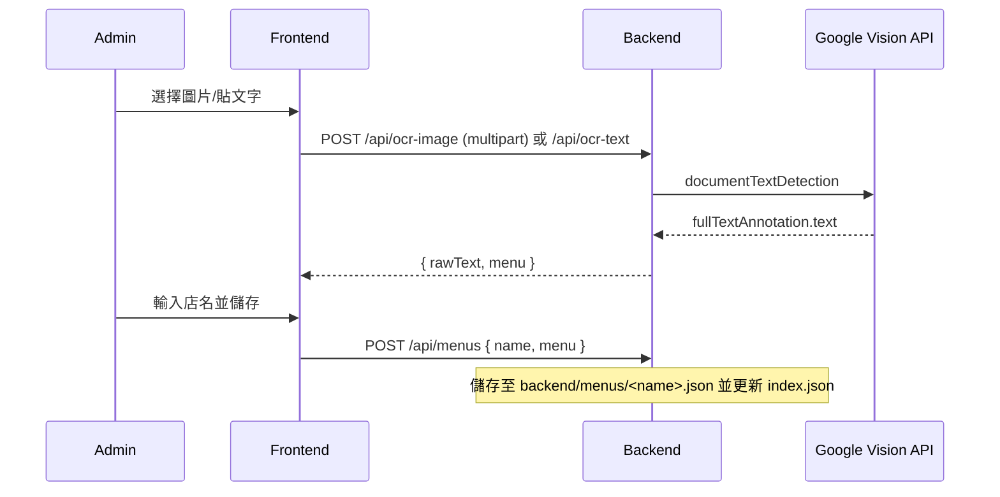

## 魔法最終章｜OCR 菜單大平台：一鍵上傳、多店共管、智慧點單

把 day22 的 OCR 能力整合到點單系統（day23）。支援多店菜單上傳命名、菜單召喚樹挑飲料、擴充訂單欄位，以及「店家熱度」分析圖表。本文比照昨天的篇幅與敘事方式，補充完整的動機、User Story 對照、檔案改動說明、關鍵程式碼與設計思路。昨天文章參考：[Day22：用 Google Vision (OCR) 召喚飲料菜單](https://ithelp.ithome.com.tw/articles/10396847)。

---

### 目標
- 管理者上傳圖片或貼文字 → Google Vision OCR → 預覽 menu.json → 輸入店名儲存
- 使用者在點餐頁選「店家 → 分類 → 品項 → 尺寸」完成下單
- 分析頁新增「店家熱度（各店杯數）」圖表

---

### 為什麼要做（背景與動機）
- 上班族團購飲料越點越多，新增一家店要重建一次菜單，開發/維護成本高。
- Day22 只能在獨立專案上傳與儲存 `menu.json`，尚未串回主系統；需要轉成「多店共管」模式。
- 實務上菜單常變（季節款、價格調整），應允許管理者快速上傳圖片、檢視、覆蓋儲存；一般使用者則只需體驗「選店→選飲料」即可。

本篇將 Day22 的 OCR 流程產品化、模組化，納入點單平台，並用 API 與 State 管理打通資料流。

---

### User Stories
- 作為管理者，我要上傳店家菜單（圖片/文字），命名後儲存，供大家點單。
- 作為使用者，我要先選店，再選分類/品項/尺寸與價格，送出訂單。
- 作為管理者，我要看到哪一家最受歡迎（各店杯數統計）。

---

### 系統流程（Flow）

```mermaid
flowchart LR
  A[Admin 上傳圖片/貼文字] -->|/api/ocr-image or /api/ocr-text| B[後端 Google Vision 解析]
  B --> C[解析器 parseMenuText → menu.json]
  C -->|Admin 輸入店名| D[/api/menus 儲存 多店菜單/]
  D --> E[點餐頁載入 /api/menus 列店名]
  E --> F[使用者選店 → /api/menus/:name 取菜單]
  F --> G[選分類→品項→尺寸→價格]
  G --> H[/api/orders 建立訂單/]
  H --> I[分析頁 /api/orders 彙整 → 店家熱度圖表]
```


---

### 簡要時序圖（Sequence）


---

### User Story 對照表（功能 × 檔案 × 為什麼）

| 使用者故事 | 需要的功能/端點 | 主要改動檔案 | 為什麼需要它 |
|---|---|---|---|
| 管理者要上傳圖片並解析 | `POST /api/ocr-image`（multipart） | `backend/server.js`、`frontend/src/pages/AdminOCRPage.vue`、`frontend/src/services/http.js` | 讓瀏覽器以 FormData 自動帶 boundary，上傳圖片給後端呼叫 Vision API，回傳 rawText+menu 預覽 |
| 管理者要貼上純文字解析 | `POST /api/ocr-text` | 同上 | demo 與除錯用，避免圖片失敗時無從測試；也可貼 OCR 結果重跑解析器 |
| 管理者要命名並儲存為店家 | `POST /api/menus` | `backend/server.js`、`backend/menus/index.json` | 以「檔案」做店家菜單版本化與落地；索引集中管理店名清單 |
| 使用者在前端選店 | `GET /api/menus` 取得清單、`GET /api/menus/:name` 取菜單 | `frontend/src/pages/MenuWizardPage.vue`、`frontend/src/stores/menuStore.js` | 列表化店名、點選後載入該店菜單並顯示分類與品項 |
| 點餐時要存下店名/尺寸/價格 | 訂單欄位擴充 | `backend/server.js (POST /api/orders)`、`frontend/src/pages/OrderPage.vue` | 分析與對帳需要知道來源店家與價格，保留 `drink` 以相容舊資料 |
| 看到各店熱度 | 分析彙整 | `backend/server.js (/api/analytics/summary)`、`frontend/src/pages/AnalyticsPage.vue` | 將同店杯數聚合，產出「店家熱度」圖表 |

---

### 主要改動與路徑

#### 後端（day23/backend）
- `server.js`
  - 新增 Google Vision 與 multer 上傳
  - 新增端點：
    - `POST /api/ocr-image`：上傳圖片解析（admin）
    - `POST /api/ocr-text`：貼文字解析（admin）
    - `GET /api/menus`：列出已儲存店家
    - `GET /api/menus/:name`：取得指定店家菜單
    - `POST /api/menus`：儲存 `{ name, menu }`（admin）
  - 新增解析器 `parseMenuText`：
    - 支援分類標題自動偵測（找好茶/找奶茶/找拿鐵/找新鮮）
    - 同行與雙行價格（「品名 35 50」或「品名\n35 50」）
    - 尺寸輸出：M/L 或 default
  - 訂單欄位擴充：`shop, category, item, size, price`（保留 `drink` 相容）

> 設計取捨：菜單改用「檔案化」而非資料庫，對個人或小團隊部署最輕；若改成 DB，只要把 `saveMenuByName`/`readMenuByName` 改成 CRUD 即可。

- `package.json`
  - 依賴：`@google-cloud/vision`、`multer`、`dotenv`

- `.env`（本機）
```
GOOGLE_APPLICATION_CREDENTIALS=完整路徑\to\gcp-service-account.json
```

> 憑證與 .env 請勿入庫，已在 .gitignore 排除。

#### 前端（day23/frontend）
- 路由（`src/router/index.js`）
  - 新增 `/menu`（菜單召喚樹）
  - 新增 `/admin/ocr`（OCR 管理，admin）

- 版頭（`src/layouts/MainLayout.vue`）
  - 新增導覽：「菜單召喚樹」「OCR 管理」

- Admin 頁（`src/pages/AdminOCRPage.vue`）
  - 圖片上傳 `multipart/form-data` → `/api/ocr-image`
  - 貼文字 → `/api/ocr-text`
  - 預覽 menu.json，輸入店名 → `/api/menus` 儲存

> 重點：用 axios 攔截器偵測 `FormData`，不要手動設 `Content-Type`，讓瀏覽器自動帶 boundary，multer 才能正確解析。

- 菜單召喚樹（`src/pages/MenuWizardPage.vue`）
  - 選店→分類→品項→尺寸→加入訂單（含 shop/item/size/price）

- 點餐頁（`src/pages/OrderPage.vue`）
  - 加入「選擇店家」；飲品清單改為使用菜單原名顯示

- 分析頁（`src/pages/AnalyticsPage.vue`）
  - 新增「店家熱度（下單杯數）」圖表

- 狀態（`src/stores/menuStore.js`）
  - 相容舊祕書菜單（`drinks: []`）與新 OCR 菜單（`categories[].items[].name`）
  - 甜度/冰量若菜單未提供，給預設清單

- HTTP（`src/services/http.js`）
  - 攔截器：若為 `FormData`，移除固定 `Content-Type`，交由瀏覽器自動帶 boundary

---

### i18n 字典調整與策略
- OCR 菜單使用實際品名（例如「梅の緑」「1號(四季春珍波椰)」），不一定在字典中。
- 為避免漏譯造成空白，點餐頁直接以品名原文顯示；若需要翻譯，可於 `i18n.json` 的 `drinks` 區塊自行補齊。
- 甜度/冰量：若菜單未提供選項，前端提供預設清單，且仍會套用字典翻譯（不同語系可自訂）。

範例：在 `day23/backend/i18n.json` 補入 drinks 對應（選擇性）：
```json
{
  "languages": ["zh-TW", "en-US"],
  "drinks": {
    "茉莉綠茶": { "en-US": "Jasmine Green Tea" },
    "阿薩姆紅茶": { "en-US": "Assam Black Tea" },
    "珍珠奶茶": { "en-US": "Pearl Milk Tea" },
    "1號(四季春珍波椰)": { "en-US": "No.1 Four Seasons with Jelly & Coconut" }
  },
  "sweetness": {
    "去糖": { "en-US": "No Sugar" },
    "微糖": { "en-US": "Light" },
    "半糖": { "en-US": "Half" },
    "少糖": { "en-US": "Less" },
    "全糖": { "en-US": "Full" }
  },
  "ice": {
    "去冰": { "en-US": "No Ice" },
    "微冰": { "en-US": "Light Ice" },
    "少冰": { "en-US": "Less Ice" },
    "正常冰": { "en-US": "Regular Ice" },
    "熱飲": { "en-US": "Hot" }
  }
}
```

---

### 關鍵程式片段（節錄）

後端：圖片 OCR 端點
```js
app.post('/api/ocr-image', upload.single('file'), async (req, res) => {
  const [result] = await ocrClient.documentTextDetection({ image: { content: req.file.buffer } })
  const text = result.fullTextAnnotation?.text || ''
  const menu = parseMenuText(text)
  res.json({ rawText: text, menu })
})
```

後端：解析器（雙行/同行、分類偵測、尺寸）
```js
function parseMenuText(text) {
  let clean = (text || '').replace(/[●•·]/g, '').replace(/\u3000/g, ' ').replace(/\s{2,}/g, ' ')
  const lines = clean.split(/\r?\n/).map(s => s.trim()).filter(Boolean)
  const categories = []
  let current = null
  function normCat(s){
    if (/^找\s*好\s*茶/.test(s)) return '找好茶'
    if (/^找\s*奶\s*茶/.test(s)) return '找奶茶(奶精)'
    if (/^找\s*拿\s*鐵/.test(s)) return '找拿鐵(鮮奶)'
    if (/^找\s*新\s*鮮/.test(s)) return '找新鮮(無咖啡因)'
    return null
  }
  const nameOnly = /^[A-Za-z0-9\u4e00-\u9fa5の／\/\(\)\.\-\s]+$/
  const two = /^(\d{2,})\s+(\d{2,})$/
  const one = /^(?:NT\$|\$)?(\d{2,})(?:元)?$/
  const sameLineTwo = /^(.+?)\s+(\d{2,})\s+(\d{2,})$/
  const sameLineOne = /^(.+?)\s+(\d{2,})$/
  for (let i=0;i<lines.length;i++){
    const line = lines[i]
    const cat = normCat(line)
    if (cat){ current = { name: cat, items: [] }; categories.push(current); continue }
    if (!current) continue
    let m = line.match(sameLineTwo)
    if (m){ current.items.push({ id: m[1], name: m[1], sizes:[{name:'M',price:+m[2]},{name:'L',price:+m[3]}]}); continue }
    m = line.match(sameLineOne)
    if (m){ current.items.push({ id: m[1], name: m[1], sizes:[{name:'default',price:+m[2]}]}); continue }
    if (nameOnly.test(line) && !/^M$|^L$/i.test(line)){
      const next = lines[i+1] || ''
      let mm = next.match(two)
      if (mm){ current.items.push({ id: line, name: line, sizes:[{name:'M',price:+mm[1]},{name:'L',price:+mm[2]}]}); i++; continue }
      mm = next.match(one)
      if (mm){ current.items.push({ id: line, name: line, sizes:[{name:'default',price:+mm[1]}]}); i++; continue }
    }
  }
  return { metadata:{ currency:'TWD', locale:'zh-TW', version:new Date().toISOString().slice(0,10) }, categories }
}
```

前端：FormData 自動 boundary（axios 攔截器）
```js
http.interceptors.request.use((config) => {
  if (config.data instanceof FormData) {
    if (config.headers) delete config.headers['Content-Type']
  } else {
    config.headers = { ...(config.headers || {}), 'Content-Type': 'application/json' }
  }
  return config
})
```

前端：OCR 菜單展平成 drinks（相容舊格式）
```js
const drinks = computed(() => {
  const d = menu.value.drinks
  if (Array.isArray(d) && d.length) return d
  const cats = menu.value.categories
  if (Array.isArray(cats) && cats.length) {
    const names = []
    for (const c of cats) for (const it of (c.items || [])) names.push(it.name)
    return names
  }
  return []
})
```

前端：Admin OCR 上傳與解析（節錄）
```vue
<input type="file" accept="image/*" @change="onFileChange" />
<button @click="parseImage" :disabled="!hasFile">上傳圖片並解析</button>
// ...
const file = ref(null)
const hasFile = computed(() => !!file.value)
async function parseImage () {
  const fd = new FormData(); fd.append('file', file.value)
  const { data } = await http.post('/api/ocr-image', fd)
  rawText.value = data.rawText; menuJson.value = JSON.stringify(data.menu, null, 2)
}
```

前端：MenuWizard（選店→分類→品項→尺寸→加入訂單，節錄）
```js
const categories = computed(() => (menuStore.menu?.categories || []).map(c => c.name))
const items = computed(() => {
  const cat = (menuStore.menu?.categories || []).find(c => c.name === selectedCategory.value)
  return cat ? cat.items : []
})
async function addToOrder(){
  const sizeObj = selectedItem.value.sizes.find(s => s.name === selectedSize.value)
  await orderStore.createOrder({
    name:'guest', shop:selectedShop.value, category:selectedCategory.value,
    item:selectedItem.value.name, size:selectedSize.value, price:sizeObj?.price,
    drink:selectedItem.value.name, sweetness:'', ice:''
  })
}
```

---

### 今日完整程式（重點頁面）

> 以下為今天新增/改動的三個主要前端頁面（已簡化樣式，只保留核心程式與結構）。

#### 1) OCR 管理頁（/admin/ocr）—— 上傳圖片/貼文字 → 解析 → 命名儲存
```vue
<!-- day23/frontend/src/pages/AdminOCRPage.vue -->
<script setup>
import { ref, computed } from 'vue'
import { http } from '../services/http'
import { useToastStore } from '../stores/toastStore'

const toast = useToastStore()
const rawText = ref('')
const menuJson = ref('')
const name = ref('')
const file = ref(null)
const hasFile = computed(() => !!file.value)
function onFileChange(e){ file.value = e?.target?.files?.[0] || null }

async function parseText(){
  const { data } = await http.post('/api/ocr-text', { text: rawText.value })
  menuJson.value = JSON.stringify(data.menu, null, 2)
}
async function parseImage(){
  if (!file.value) return
  const fd = new FormData(); fd.append('file', file.value)
  const { data } = await http.post('/api/ocr-image', fd)
  rawText.value = data.rawText
  menuJson.value = JSON.stringify(data.menu, null, 2)
}
async function saveMenu(){
  const menu = JSON.parse(menuJson.value || '{}')
  await http.post('/api/menus', { name: name.value, menu })
  toast.success('菜單已儲存')
}
</script>

<template>
  <section>
    <h2>OCR 上傳與命名（admin）</h2>
    <div class="grid2">
      <div>
        <h3>貼上 OCR 原文</h3>
        <textarea v-model="rawText" placeholder="貼上 OCR 純文字"></textarea>
        <button class="btn" @click="parseText" :disabled="!rawText">解析</button>
        <div class="uploader">
          <input type="file" accept="image/*" @change="onFileChange" />
          <button class="btn" @click="parseImage" :disabled="!hasFile">上傳圖片並解析</button>
        </div>
      </div>
      <div>
        <h3>解析結果 menu.json</h3>
        <textarea v-model="menuJson" placeholder="解析結果"></textarea>
        <div class="row">
          <input v-model="name" placeholder="輸入菜單名稱，如 50lan" />
          <button class="btn primary" @click="saveMenu" :disabled="!name || !menuJson">儲存為店家菜單</button>
        </div>
      </div>
    </div>
  </section>
</template>
```

#### 2) 菜單召喚樹（/menu）—— 選店 → 分類 → 品項 → 尺寸 → 加入訂單
```vue
<!-- day23/frontend/src/pages/MenuWizardPage.vue -->
<script setup>
import { ref, computed, onMounted } from 'vue'
import { useMenuStore } from '../stores/menuStore'
import { useOrderStore } from '../stores/orderStore'
import { useToastStore } from '../stores/toastStore'

const menuStore = useMenuStore()
const orderStore = useOrderStore()
const toast = useToastStore()

const step = ref(1)
const selectedShop = ref('')
const selectedCategory = ref('')
const selectedItem = ref(null)
const selectedSize = ref('')

const categories = computed(() => (menuStore.menu?.categories || []).map(c => c.name))
const items = computed(() => {
  const cat = (menuStore.menu?.categories || []).find(c => c.name === selectedCategory.value)
  return cat ? cat.items : []
})

onMounted(menuStore.loadShops)
async function startPick(){ if (selectedShop.value) { await menuStore.loadShopMenu(selectedShop.value); step.value = 2 } }
function pickCategory(n){ selectedCategory.value = n; step.value = 3 }
function pickItem(it){ selectedItem.value = it; step.value = 4 }
function pickSize(sz){ selectedSize.value = sz.name }

async function addToOrder(){
  const sz = selectedItem.value.sizes.find(s => s.name === selectedSize.value)
  await orderStore.createOrder({
    name: 'guest', shop: selectedShop.value, category: selectedCategory.value,
    item: selectedItem.value.name, size: selectedSize.value, price: sz?.price,
    drink: selectedItem.value.name, sweetness: '', ice: ''
  })
  toast.success('已加入訂單')
}
</script>

<template>
  <section>
    <h2>菜單召喚樹</h2>
    <div class="card">
      <select v-model="selectedShop">
        <option value="" disabled>請選擇店家</option>
        <option v-for="s in menuStore.shops" :key="s" :value="s">{{ s }}</option>
      </select>
      <button class="btn" @click="startPick" :disabled="!selectedShop">載入菜單</button>
    </div>

    <div class="card" v-if="step>=2">
      <h3>選擇分類</h3>
      <button class="chip" v-for="c in categories" :key="c" @click="pickCategory(c)">{{ c }}</button>
    </div>

    <div class="card" v-if="step>=3">
      <h3>選擇品項</h3>
      <div class="grid">
        <div class="item" v-for="it in items" :key="it.id" @click="pickItem(it)">
          <div class="name">{{ it.name }}</div>
          <div class="sizes"><span v-for="s in it.sizes" :key="s.name">{{ s.name }}: {{ s.price }}</span></div>
        </div>
      </div>
    </div>

    <div class="card" v-if="step>=4 && selectedItem">
      <h3>選擇尺寸</h3>
      <button class="chip" v-for="s in selectedItem.sizes" :key="s.name" @click="pickSize(s)">{{ s.name }}（{{ s.price }}）</button>
      <div class="actions"><button class="btn primary" :disabled="!selectedSize" @click="addToOrder">加入訂單</button></div>
    </div>
  </section>
</template>
```

#### 3) 點餐頁（/order）—— 自動載入店家清單 + 手動選店載入菜單
```vue
<!-- day23/frontend/src/pages/OrderPage.vue （節錄） -->
<script setup>
import { onMounted, ref } from 'vue'
import { useOrderStore } from '../stores/orderStore'
import { useMenuStore } from '../stores/menuStore'
import OrderForm from '../components/OrderForm.vue'
import OrderList from '../components/OrderList.vue'
import { useI18nStore } from '../stores/i18nStore'

const orderStore = useOrderStore()
const menuStore = useMenuStore()
const i18nStore = useI18nStore()
const selectedShop = ref('')

onMounted(async () => { await orderStore.loadOrders(); await menuStore.loadShops() })
async function onPickShop(){ if (selectedShop.value) await menuStore.loadShopMenu(selectedShop.value) }
function handleSubmit(payload){
  const withShop = { ...payload, shop: menuStore.currentShop || '', item: payload.drink, category: '', size: '', price: undefined }
  orderStore.createOrder(withShop)
}
</script>

<template>
  <section>
    <div class="shop-picker">
      <label>選擇店家</label>
      <select v-model="selectedShop" @change="onPickShop">
        <option value="" disabled>請選擇</option>
        <option v-for="s in menuStore.shops" :key="s" :value="s">{{ s }}</option>
      </select>
      <span v-if="menuStore.currentShop">目前菜單：{{ menuStore.currentShop }}</span>
    </div>
    <OrderForm
      :drinks="menuStore.drinks.map(d => ({ value: d, label: d }))"
      :sweetness-options="menuStore.sweetnessOptions.map(s => ({ value: s, label: i18nStore.translate('sweetness', s, $i18n.locale) }))"
      :ice-options="menuStore.iceOptions.map(i => ({ value: i, label: i18nStore.translate('ice', i, $i18n.locale) }))"
      :menu-rules="menuStore.rules"
      @submit="handleSubmit"
    />
    <h3>目前已送出的訂單（{{ orderStore.orders.length }}）</h3>
    <OrderList :orders="orderStore.orders" />
  </section>
</template>
```

---

### 如何啟動與測試
1. 後端安裝依賴並啟動（day23/backend）
   ```bash
   npm i
   npm run dev
   ```
2. 設定 `.env`：`GOOGLE_APPLICATION_CREDENTIALS=.../gcp-service-account.json`
3. 前端啟動（day23/frontend）
   ```bash
   npm i
   npm run dev
   ```
4. 以 admin 登入 → 進入 `/admin/ocr`：上傳圖片解析、命名儲存
5. 進入 `/menu` 或 `/order`：選店 → 分類/品項/尺寸 → 送單
6. 進入 `/analytics`：檢視「店家熱度（下單杯數）」

---

### 里程碑
- 完成 OCR → 菜單 → 點單 → 分析的閉環產品化串接。
- 新菜單格式（OCR）與舊格式（祕書）同時相容。
- 架構上可持續擴增：店家檔案分離、索引管理、視覺化分析。


